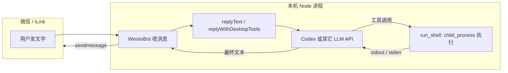
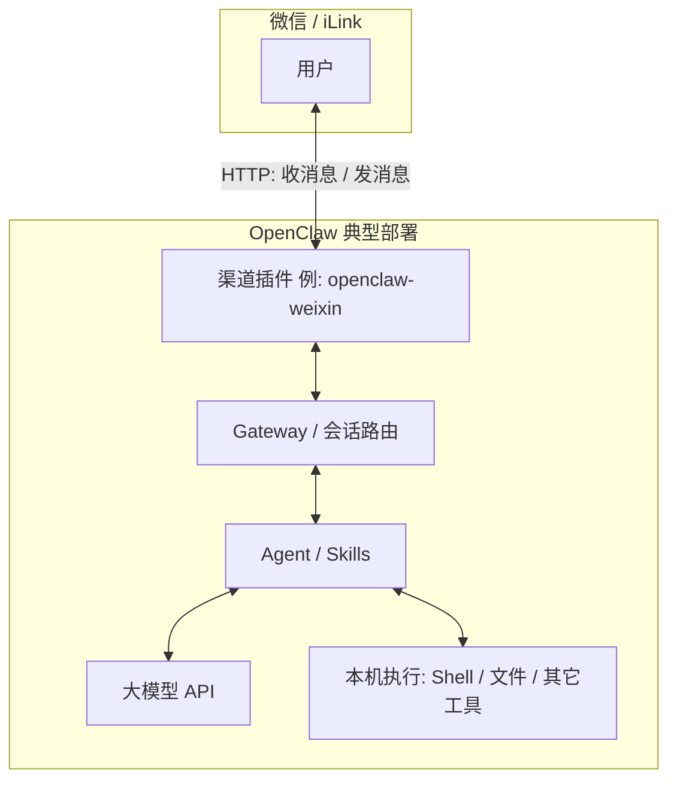

# 微信机器人、Codex 与「操作本机」的原理

本文说明 `weixin-agent-bot` 中：**微信消息 → LLM（含 Codex）→ 可选的本机 shell 执行 → 再回复微信** 的分层与数据流。适用于理解 `WEIXIN_DESKTOP_TOOLS=1` 与纯对话模式的区别。

## 1. 微信这一层：只负责收发消息

微信 iLink 协议做的是：长轮询收消息、用 `sendmessage` 发消息；每条会话需要带上 **`context_token`**，才能把回复投递到正确的聊天窗口。

**协议本身不包含「在用户电脑上执行命令」的字段**，只有文本（以及图片、文件等媒体）的传递。

本项目中，`@pinixai/weixin-bot` 封装了上述 HTTP 细节；业务代码只处理「收到一条文本 `msg.text`」。

## 2. 应用层：收到字以后做什么

在 `src/bot/weixin-runner.ts` 中，每条文本消息会调用 `replyText`，其返回值即为要发回微信的**完整字符串**（可能已包含模型根据多轮工具结果整理好的最终回复）。

## 3. LLM 层：纯聊天 vs 带工具（桌面模式）

在 `src/llm/reply.ts` 中：

- 若 **`WEIXIN_DESKTOP_TOOLS` 不是 `1`**：走单次对话路径（Codex 或其它 provider 一次请求、一次文本回复），**不在本机执行命令**。
- 若 **`WEIXIN_DESKTOP_TOOLS=1`**：走 `replyWithDesktopTools`（`src/llm/reply-agent.ts`），进入 **多轮 Agent 循环**。

环境变量相当于**总开关**：避免误以为「接了 Codex」就默认允许本机被遥控；只有显式打开才会注册 `run_shell` 等工具。

## 4. 「操作本机」如何发生（核心）

与微信无关，全部发生在 **运行 CLI 的本机 Node 进程** 内：

1. **工具定义**（如 `run_shell`）通过 `@mariozechner/pi-ai` 的 `Tool` / OpenAI 兼容的 `tools` 声明给模型。
2. 请求发往 **支持 function / tool calling 的模型**（如 Codex 路径下的 `completeSimple` 携带 `tools`）。
3. 模型可能返回：
   - **工具调用**：例如执行 `run_shell`，参数为 `command` 字符串；或
   - **最终自然语言**：不再调用工具，直接输出给用户看的内容。
4. 代码在 **`src/llm/tool-runtime.ts`** 中用 `child_process` **在本机执行**该命令，将终端输出作为工具结果。
5. 将工具结果写回对话历史，**再次调用模型**，直到得到最终回复文本（或达到步数上限）。

因此：**不是微信在操作电脑**，而是 **Node 进程根据模型的结构化输出，主动调用本机 shell**。微信只负责展示最终发回的文本。

## 5. Codex 在链路中的角色

- **认证**：使用本地 OAuth 凭证（默认 `~/.weixin-gpt/codex-auth.json`），通过 `getOAuthApiKey` 换取 API 访问。
- **推理**：在开启桌面工具时，使用 `completeSimple` 并传入 **`tools`**，使模型可以返回 **tool call**。

Codex **不直接获得系统 shell 权限**；它只决定「是否发起工具调用、命令行写什么」。**真正执行命令的是本机上的 bot 进程。**

## 6. 数据流简图

## 7. OpenClaw 的原理与架构（对照）

腾讯 **`@tencent-weixin/openclaw-weixin`** 等产品化路径里，微信侧协议与上文一致（`getupdates` / `sendmessage` / `context_token` 等），差异主要在**进程形态**：微信被做成 **OpenClaw 的一个「渠道插件」**，挂在 **OpenClaw Gateway** 上，与 **Agent / 技能（Skills）**、**模型** 在同一套运行时里协作。

要点：

- **微信 / iLink**：只做消息传输，不包含「遥控电脑」的语义。
- **渠道插件**（如 `openclaw-weixin`）：实现扫码登录、长轮询、发消息、媒体 CDN 等，把聊天内容交给上层。
- **Gateway / 路由**：把各渠道来的会话交给对应 Agent 配置（多账号、上下文隔离等由 OpenClaw 配置层处理，例如 `agents.mode`）。
- **Agent / Skills**：多轮对话、工具调用、业务逻辑；**本机执行**（命令、文件、自动化）发生在这里或 Skills 所调用的进程里，而不是微信协议里。
- **模型**：只负责推理与是否发起「工具调用」；真正执行仍在 **运行 OpenClaw 的那台机器** 上。

下面是与本仓库「微信 → Node → LLM → 可选本机 shell」**同构**的一层抽象（OpenClaw 实际模块名以官方仓库为准）：

**与本项目的关系**：`weixin-agent-bot` 相当于把上图里的 **CH + 一段简化的 AG** 写进一个 Node CLI；若开启 `WEIXIN_DESKTOP_TOOLS`，则 **HOST** 对应本仓库的 `run_shell`（`tool-runtime`）。未使用 OpenClaw Gateway 时，没有插件热插拔与多技能生态，但**分层原理一致**：消息走微信协议，**操作电脑在宿主进程内完成**。

## 8. 相关源码与配置

| 说明 | 位置 |
|------|------|
| 消息入口、回微信 | `src/bot/weixin-runner.ts` |
| 是否走桌面工具 | `src/llm/reply.ts`（判断 `WEIXIN_DESKTOP_TOOLS`） |
| 多轮工具循环 | `src/llm/reply-agent.ts` |
| 本机执行命令 | `src/llm/tool-runtime.ts` |
| 工具定义 | `src/llm/tools-def.ts` |
| 环境变量示例 | 根目录 `.env.example` |

## 9. 安全提示

开启 `WEIXIN_DESKTOP_TOOLS=1` 等价于允许 **能通过聊天触发 bot 的一方**（在模型配合下）间接执行 **你机器上的 shell**。仅应在**可信环境**下使用，并了解相关风险。
